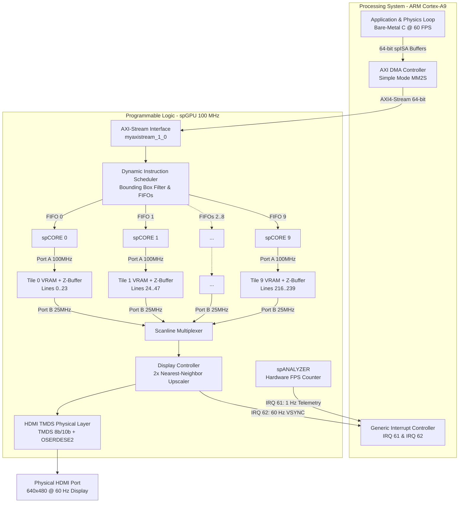

# spGPU: A Tiled Multicore 2D/2.5D Graphics Processing Unit on FPGA

**spGPU** (*Sapienza GPU*) is a custom, high-performance 2D/2.5D multicore graphics processor implemented on a **Xilinx Zynq-7000 SoC FPGA** (Digilent PYNQ-Z1). Designed from the ground up for the Digital System Programming (DSP) course at **Sapienza University of Rome** by **Valerio Cilento** and **Luca Filogna**, the architecture features spatial multicore parallelism, dedicated hardware rasterizers, on-chip distributed video memory with hardware Z-buffering, and a direct HDMI physical transmitter.

---

## Key Highlights & Architectural Features

- **Spatial Multicore Tiling**: The $320 \times 240$ display canvas is partitioned into **10 horizontal tiles** of $320 \times 24$ pixels each. Ten independent compute cores (**`spCORE`**) operate in parallel at $100\,\text{MHz}$, providing up to **$10\times$ rasterization speedup**.
- **Contention-Free Distributed VRAM**: Each core writes exclusively to its dedicated **True Dual-Port Block RAM tile**. No bus arbitration, no memory crossbars, and zero wait states during parallel writes.
- **Hardware Z-Buffering (Depth Test)**: Integrated 4-bit depth memory per tile ($16$ discrete depth layers). Single-cycle depth comparisons resolve 2.5D/3D occlusion automatically with zero CPU sorting overhead.
- **Dynamic Instruction Scheduler**: Evaluates primitive bounding boxes in single-cycle combinatorial logic, routing 64-bit commands selectively only to the cores whose tiles overlap the geometry.
- **Zero-Tearing Double Buffering & Auto-Clear**: Front and back buffers swap synchronously during the vertical blanking interval (VSYNC). An autonomous hardware engine cleans the back buffer to white and resets depth on every swap.
- **Direct Native HDMI Output**: Built-in VGA timing generator, $2\times$ hardware nearest-neighbor upscaler ($320 \times 240 \to 640 \times 480$ @ $60\,\text{Hz}$), TMDS 8b/10b encoders, and 5:1 DDR `OSERDESE2` serializers driving the physical HDMI port directly.
- **Deterministic 60 FPS Dual-Interrupt System**: Connects hardware performance telemetry ($1\,\text{Hz}$ FPS tick on IRQ 61) and display vertical sync ($60\,\text{Hz}$ VSYNC on IRQ 62) to the ARM CPU, locking the physics simulation to rock-solid $60\,\text{FPS}$.

---

## High-Level System Architecture

The system operates as a tightly integrated heterogeneous System-on-Chip (SoC): the **Processing System (ARM Cortex-A9)** executes high-level physics, collision detection, and scene management, streaming 64-bit graphics commands via **AXI DMA** into the **Programmable Logic (FPGA GPU)**.



---

## How It Works

### 1. Instruction Streaming (`spISA`)
The CPU issues drawing commands formatted according to **spISA**, a compact 64-bit instruction format encoding opcode, 4-bit depth $Z$, packed 9-bit coordinates ($X, Y \in [0, 511]$), and 15-bit RGB555 colors. Commands are transferred to the GPU via AXI DMA with zero CPU polling.

Supported hardware primitives include:
- `DRAWPIXEL`, `DRAWLINE` (Bresenham line engine)
- `DRAWTRIANGLE`, `DRAWTRIANGLE_F` (Edge equations half-space rasterizer)
- `DRAWCIRCLE`, `DRAWCIRCLE_F` (Midpoint circle and horizontal span fill)
- `SETCOLOR`, `SWAP_BUFFERS`, `NOP`

### 2. Intelligent Spatial Scheduling
Instead of broadcasting every command to all cores, the **`spScheduler`** computes the vertical bounding box $[Y_{\min}, Y_{\max}]$ of each shape in single-cycle combinatorial logic. It clamps coordinates to prevent underflow/overflow and writes the command **only to the FIFOs of the cores whose tiles overlap the primitive**. Global operations (`SETCOLOR`, `SWAP_BUFFERS`) are broadcast to all cores.

### 3. Parallel Tiled Rasterization & Clipping
Each of the 10 cores processes commands independently from its local FIFO. Dedicated integer hardware rasterizers emit pixels into the tile's local VRAM:
- **Depth Test**: On every pixel write, the hardware tests if $Z_{\text{in}} \le Z_{\text{mem}}$. Obscured pixels are culled in a single cycle.
- **Hardware Boundary Clipping**: If a primitive partially extends beyond the tile's 24-line boundary, out-of-bounds pixels are suppressed without stalling the pipeline.
- **Multiplier-Free Addressing**: Memory addresses are calculated strictly using shift-and-add arithmetic ($(Y_{\text{local}} \ll 8) + (Y_{\text{local}} \ll 6) + X$), saving all FPGA DSP48 slices.

### 4. Tear-Free Double Buffering & Auto-Clear
Each tile stores two frames ($2 \times 7{,}680 = 15{,}360$ words of 15 bits). When all cores finish a frame, the GPU synchronizes with the display's vertical blanking period (`VSYNC`), flips the front and back buffer pointers, and triggers an autonomous hardware sweeper that clears the new back buffer to white and resets depth to maximum distance with zero CPU cycle penalty.

### 5. Display Scanning & $2\times$ Upscaling
The display controller scans at a standard 25 MHz VGA pixel clock ($640 \times 480$ @ $60\,\text{Hz}$). As the electron beam / raster line advances down the screen:
1. The **Scanline Multiplexer** selects pixel data from the active tile ($Y / 24$).
2. The **Upscaler** divides horizontal and vertical counters by 2 ($H[9:1], V[9:1]$), doubling each $320 \times 240$ pixel into a clean $2 \times 2$ block on screen.
3. The **TMDS Encoder** and **`OSERDESE2`** serializers transmit 250 Mbps differential streams over HDMI.

---

## Hardware Specifications Summary

| Specification | Parameter Value | Details |
|---|---|---|
| **Target Board** | Digilent PYNQ-Z1 | Xilinx Zynq-7000 SoC (`xc7z020clg400-1`) |
| **Toolflow** | AMD Xilinx Vivado 2023.1 | VHDL-2008 RTL |
| **Logical Resolution** | $320 \times 240$ pixels | 15-bit RGB555 ($32{,}768$ colors) |
| **Display Output** | $640 \times 480$ @ $60\,\text{Hz}$ | HDMI (TMDS 8b/10b, 5:1 DDR @ 125 MHz) |
| **Clock Domains** | 100 MHz / 25 MHz / 125 MHz | Core compute / Pixel clock / TMDS serializer |
| **Parallel Compute** | 10 Cores (`spCORE`) | 10 Horizontal Tiles ($320 \times 24$ px each) |
| **On-Chip VRAM** | 10$\times$ Dual-Port BRAMs | Double-buffered ($2 \times 7{,}680$ words/tile) |
| **Depth Sorting** | Hardware 4-bit Z-Buffer | 16 discrete layers, single-cycle test |
| **Host CPU & Bus** | Dual ARM Cortex-A9 | Bare-metal C, AXI DMA Simple Mode |
| **Interrupts** | Dual GIC Mapping | IRQ 61 (1 Hz FPS counter), IRQ 62 (60 Hz VSYNC) |

---

## Repository Structure

```
spGPU/
├── RTL/                # Primary VHDL-2008 RTL sources
│   ├── acc_RTL/        # Hardware rasterizers (line, circle, filled circle, triangle)
│   ├── frameBuffer/    # Dual-port tile VRAM, Z-buffer, and swap controller
│   ├── HDMI_interface/ # VGA timing, TMDS encoders, and OSERDESE2 serializers
│   ├── scheduler/      # Dynamic instruction scheduler and FIFO queues
│   ├── sp-core.vhd     # Single compute core top-level (spPIPE + spEXEC)
│   ├── sp-gpu.vhd      # GPU multicore structural top-level
│   └── sp-pkg.vhd      # Global package, types, constants, and math functions
├── sw/                 # Bare-metal C application and driver
│   ├── main.c          # 60 FPS Newtonian physics simulation demo
│   ├── sp_lib.c        # AXI DMA driver and spISA packet builder
│   └── sp_lib.h        # 64-bit packed bitfield unions and API declarations
├── myaxistream_1_0/    # Custom AXI4-Stream to spGPU bridge peripheral IP
├── software_sim/       # C/C++ golden algorithmic models and Raylib visual simulator
├── tb/                 # VHDL testbench suite (unit and full-chip integration)
├── doc/                # Complete 44-page LaTeX architectural specification and PDF
├── utils/              # Build scripts, Makefiles, and Vivado hardware archive (.xsa)
└── compile/            # ModelSim / QuestaSim automated simulation scripts
```

---

## Authors & Acknowledgments

Developed by **Luca Filogna** and **Valerio Cilento** for the *Digital System Programming* course at the Faculty of Information Engineering, Computer Science and Statistics, **Sapienza University of Rome**.
